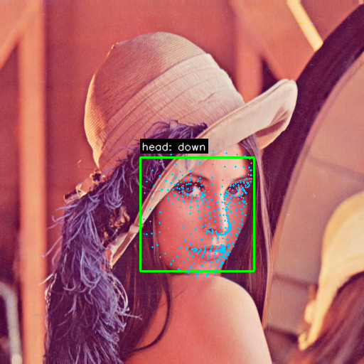

# VisionLink

Modular computer vision framework for **facial gesture recognition** from images.  
VisionLink runs fully offline on your machine — no cloud, no camera required for the current release.

Process a single photo or an entire folder, then get annotated images and structured JSON output.

---

## What it does

| Step | Capability |
|------|------------|
| **Load** | Read JPEG / PNG images from disk |
| **Detect** | Find faces and return bounding boxes (MediaPipe BlazeFace) |
| **Landmark** | Extract 478 facial landmark points per face |
| **Recognize** | Classify gestures from landmark geometry |
| **Visualize** | Draw boxes, landmarks, and gesture labels on the image |
| **Export** | Save annotated PNG + JSON results |
| **Batch** | Process every image in a folder independently |

### Gestures detected

- Smile
- Mouth open
- Left / right eye open or closed
- Both eyes closed
- Head pose — left, right, up, down, or center

---

## Example

**Input** → **Output**

| Original | Annotated result |
|----------|------------------|
|  |  |

```bash
visionlink images/face.jpg -o images/results
```

The annotated image shows:
- **Green box** — detected face
- **Cyan dots** — 478 facial landmarks
- **Label** — recognized head pose (`head: down` in this example)

### Sample JSON output

```json
{
  "source": "images/face.jpg",
  "face_count": 1,
  "faces": [
    {
      "bbox": { "x": 197, "y": 221, "width": 160, "height": 160 },
      "smile": false,
      "mouth_open": false,
      "left_eye": "open",
      "right_eye": "open",
      "both_eyes_closed": false,
      "head_pose": "down"
    }
  ]
}
```

---

## Quick start

```bash
python -m venv .venv
source .venv/bin/activate
pip install -r requirements.txt
pip install -e .

# Download models (first-time setup)
mkdir -p models
wget -q -O models/blaze_face_short_range.tflite \
  https://storage.googleapis.com/mediapipe-models/face_detector/blaze_face_short_range/float16/1/blaze_face_short_range.tflite
wget -q -O models/face_landmarker.task \
  https://storage.googleapis.com/mediapipe-models/face_landmarker/face_landmarker/float16/1/face_landmarker.task

# Single image
visionlink images/face.jpg

# Batch — process every image in a folder
visionlink images/ -o results/
```

---

## CLI usage

```text
visionlink <image-or-folder> [-o OUTPUT] [--no-landmarks] [--no-json]
```

| Argument / Flag | Description |
|-----------------|-------------|
| `input` | Path to a JPEG/PNG image **or** a directory (batch mode) |
| `-o`, `--output` | Output directory (default: `output/`) |
| `--no-landmarks` | Skip drawing landmark dots on the annotated image |
| `--no-json` | Skip writing JSON result files |
| `--version` | Print version and exit |

### Batch mode

Pass a directory instead of a file:

```bash
visionlink images/ -o results/
```

Each image is processed independently. Outputs per image:

```text
results/
├── face_annotated.png
├── face.json
├── test_annotated.png
├── test.json
└── batch_summary.json    # combined results for all images
```

---

## Architecture

Each step is a separate, replaceable module:

```text
CLI  →  Controller  →  Image Loader
                    →  Face Detector
                    →  Landmark Detector
                    →  Gesture Engine
                    →  Visualizer / JSON
```

```text
src/visionlink/
├── acquisition/    # Image loading + batch discovery
├── controller.py   # Pipeline orchestrator
├── detection/      # Face detection (MediaPipe BlazeFace)
├── landmarks/      # Landmark extraction (478 points)
├── gestures/       # Gesture recognition (EAR, MAR, head pose)
├── output/         # Visualization + JSON export
├── cli.py          # Command-line interface
└── models.py       # Shared data types (Face, BoundingBox, …)
```

---

## Requirements

- Python 3.11+
- Linux, macOS, or Windows
- OpenCV + MediaPipe (see `requirements.txt`)

---

## Roadmap

| Phase | Status |
|-------|--------|
| Phase 1 — Single image analysis (M1–M6) | ✓ |
| Phase 2 — Batch processing (M7) | ✓ |
| Phase 3 — Video processing | Planned |
| Phase 4 — Webcam / real-time | Planned |
| Phase 5 — Arduino serial communication | Planned |

---

## License

MIT — see [LICENSE](LICENSE).
